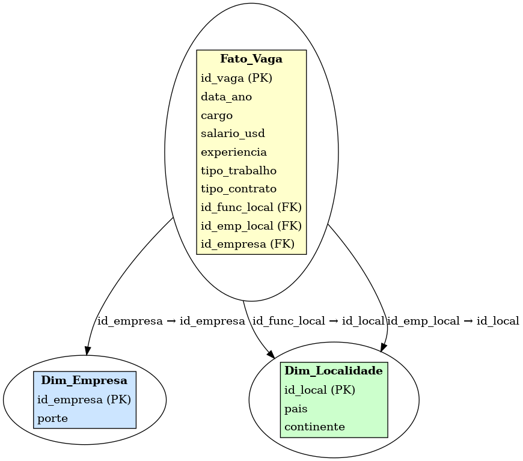

# MVP: Análise de Salários em IA e Ciência de Dados

Este repositório contém um projeto completo de análise exploratória de dados salariais de profissionais da área de dados e inteligência artificial. O objetivo principal é identificar padrões de remuneração com base em diferentes dimensões como localização, experiência, tipo de vínculo e modelo de trabalho.

---

## 🎯 Objetivo

Este projeto tem como principal objetivo analisar o impacto da Inteligência Artificial (IA), Ciência de Dados e Machine Learning no mercado de trabalho global, com ênfase em aspectos relacionados à remuneração e condições de trabalho. A partir da construção de um pipeline de dados em nuvem, serão obtidos insights relevantes sobre os salários de profissionais da área de tecnologia, considerando variáveis como localização geográfica, nível de experiência, modelo de trabalho e porte da empresa.

Perguntas de Negócio:

Qual a variação salarial média entre os diferentes níveis de experiência? (Júnior, Pleno, Sênior e Executivo)

Quais são os cargos mais frequentes entre os profissionais da área?

Como o salário médio varia conforme a localização da empresa?

Existe diferença salarial com base no porte da empresa? (pequena, média ou grande)

Como se comporta o salário médio ao cruzar país e nível de experiência?

Qual o impacto do tipo de vínculo empregatício na remuneração média? (integral, parcial, temporário, contrato)

O modelo de trabalho (presencial, híbrido ou remoto) influencia o salário?

Quais cargos relacionados à IA e Ciência de Dados apresentam os maiores salários?

Quais países lideram em número de contratações na área de dados e IA?

Como tem evoluído a média salarial dos profissionais da área ao longo dos anos?

Quais cargos apresentam maior variação salarial, indicando possível desigualdade ou amplitude de níveis dentro da função?

Existe uma disparidade salarial entre países? Quais regiões apresentam os maiores salários médios na área de dados e inteligência artificial?

## 📂 Dataset

**Fonte:** Kaggle (https://www.kaggle.com/datasets/ruchi798/data-science-job-salaries)

- Nome: `ds_salaries.csv`
- Total de registros: 607
- Colunas: cargo, salário, tipo de vínculo, experiência, localização, tipo de trabalho
- Licença: Creative Commons (uso educacional permitido)

Incluído no repositório para facilitar reprodução dos experimentos.

---

## 🛠️ Tecnologias e Bibliotecas

- Python 3.11
- Pandas
- Matplotlib / Seaborn
- Plotly (para mapa interativo)
- Jupyter Notebook (ambiente de desenvolvimento)

---

## 📊 Análises Realizadas

- Limpeza e transformação de dados com mapeamento de siglas (país, experiência, empresa)
- Gráficos de barras com os cargos mais comuns e bem pagos
- Comparação de salário médio por:
  - Nível de experiência
  - Tipo de vínculo
  - Porte da empresa
  - Modelo de trabalho remoto
  - País (mapa interativo)
- Análise de dispersão salarial por desvio padrão (cargos com maior variação)
- Evolução salarial por ano (linha do tempo)

---
## 📁 Organização dos Arquivos

MVP_Salarios_AI/

  ds_salaries.csv         # Dataset original contendo informações salariais  
  
  MVP_Salarios_AI.ipynb   # Notebook com todo o pipeline de análise, visualizações e insights 
  
  modelo_estrela.png      # Diagrama ER (modelo estrela) da modelagem de dados  
  
  figs/                   # Pasta com imagens dos gráficos gerados nas análises  
  
  README.md               # Documento explicativo com objetivos, estrutura e execução do projeto

## 📝 Catálogo de Dados e Modelagem de dados 

Modelo: Esquema Estrela (Star Schema)

Fato_Vaga

id_vaga (PK)

data_ano

cargo

salario_usd

experiencia

tipo_trabalho

tipo_contrato

id_local_funcionario (FK)

id_local_empresa (FK)

id_empresa (FK)

Dim_Localidade

id_local

pais

continente

Dim_Empresa

id_empresa

porte (S, M, L)

## Modelo Estrela (Star Schema)

O modelo de dados adotado foi o **Esquema Estrela**, onde temos a tabela fato `Fato_Vaga` e dimensões como `Dim_Empresa` e `Dim_Localidade`.

## 📑 Catálogo de Dados

| Coluna              | Tipo    | Descrição                                                                 |
|---------------------|---------|---------------------------------------------------------------------------|
| work_year           | long    | Ano em que a vaga foi registrada                                          |
| experience_level    | string  | Nível de experiência do profissional: EN (Júnior), MI (Pleno), SE (Sênior), EX (Executivo) |
| employment_type     | string  | Tipo de vínculo empregatício: FT (Full-time), PT (Part-time), CT (Contract), FL (Freelancer) |
| job_title           | string  | Título ou cargo do profissional na vaga                                  |
| salary              | long    | Valor do salário bruto na moeda local da empresa contratante             |
| salary_currency     | string  | Código da moeda em que o salário original foi informado (ex: USD, EUR)   |
| annual_salary_usd   | long    | Salário anual convertido para dólar americano (USD)                      |
| employee_residence  | string  | País de residência do funcionário (sigla do país)                        |
| remote_ratio        | long    | Percentual do trabalho remoto: 0 (presencial), 50 (híbrido), 100 (remoto)|
| company_location    | string  | País onde a empresa contratante está localizada                          |
| company_size        | string  | Porte da empresa: S (Pequena), M (Média), L (Grande)                     |

---

## 🙋‍♂️ Autor

- Nome: Bruna Gonçalves
- Curso: Engenharia de Dados
- Universidade: PUC/RIO

## 📌 Licença

Este projeto é apenas para fins educacionais, com base em dados públicos de uso livre.

